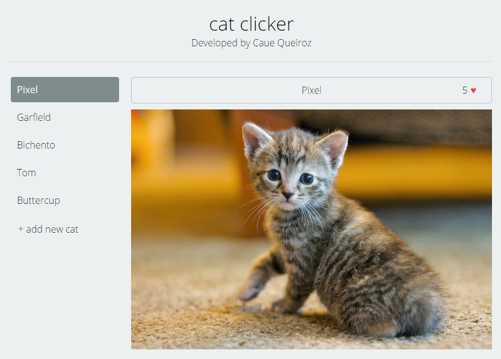

# Cat Clicker

A cute app built to learn MVC, MVVM, MV* architectures and KnockoutJS framework. The same application was developed in VanillaJS and KnockoutJS for studies purposes.

You can see the the final result [here](https://cauequeiroz.github.io/cat-clicker/vanillajs/index.html).

